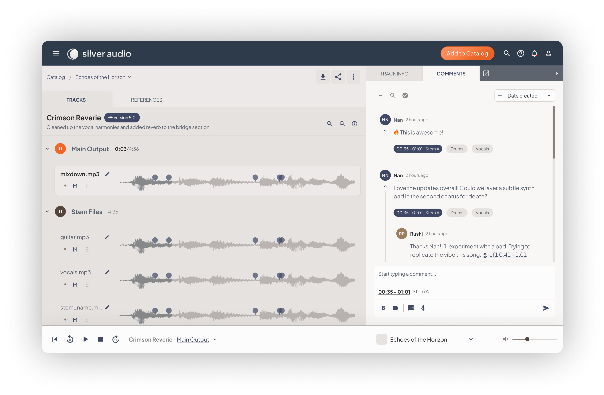

# 🌙 Welcome to Silver Audio!

We know how important a good collaboration workflow is, and we’re grateful you’ve chosen Silver Audio.

  <!-- Left Column (Text) - 30% Width -->
  

    ✅ Capture <b>timestamped comments</b> on mixes and stems.
      ✅ Guide your collaborators with <b>mix guides</b>.  
      ✅ Organize audio into <b>projects, tracks, and versions</b>.
  

  <!-- Right Column (Image) - 70% Width -->
  

    
  

<!-- --- -->

<!-- ## 🚀 Getting Started

Silver Audio helps you collaborate on audio projects with ease.

## 🎛️ Your Catalog
Everything is stored in a **catalog**, which contains:

- **Projects** (e.g., an album, audiobook, podcast season)
- **Tracks** (individual songs, chapters, episodes)
- **Versions** (different edits of a track)

## 📂 Project View
- **Play audio files** from the track list.
- **Comment on mixes and stems**. -->

[Start with Your Catalog →](catalog.md)
